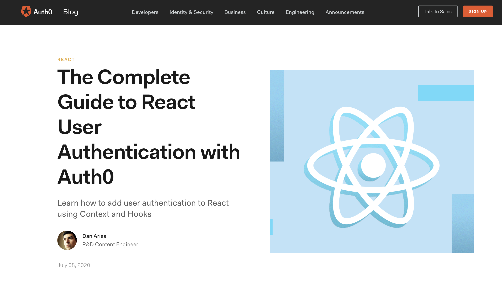

## This FULLSTACK Application follows a [tutorial](https://auth0.com/blog/complete-guide-to-react-user-authentication/#Get-the-Starter-Application)  by  [Dan Arias](https://auth0.com/blog/authors/dan-arias/)

FRONTEND 

BACKEND + API 

AUTH0 technology to authenticate users 


## How to run this app:
### Open a terminal in your operating system, move to a directory where you create your projects, and issue the following commands:

```git clone  ```


### use NPM to start the backend 


### navigate to frontend to run your React app

```cd ../frontend```

### start your React app
```npm install ```

```npm start``` should open http://localhost:3000 in your browser
